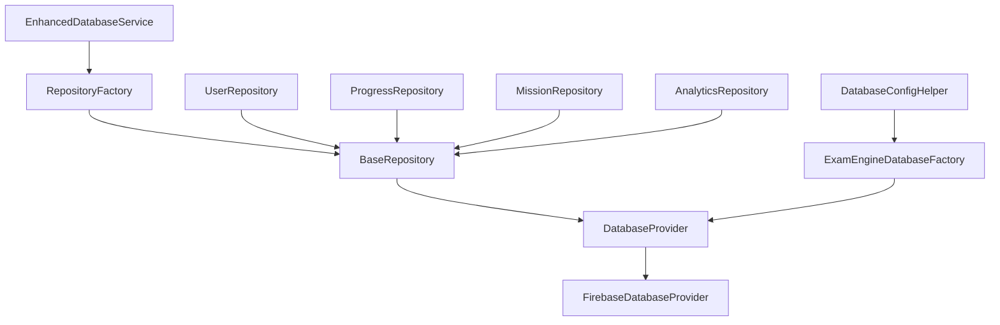
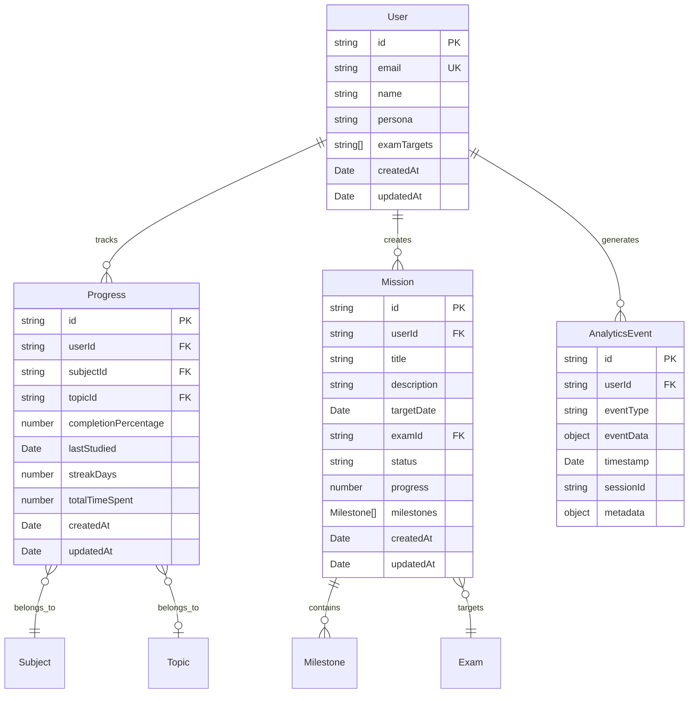

# Database Architecture & Abstraction Layer

## 📋 Table of Contents

1. [Overview](#overview)
2. [Architecture Principles](#architecture-principles)
3. [Core Components](#core-components)
4. [Database Entities & Relationships](#database-entities--relationships)
5. [Usage Examples](#usage-examples)
6. [Performance & Caching](#performance--caching)
7. [Migration & Scaling](#migration--scaling)
8. [Best Practices](#best-practices)
9. [Troubleshooting](#troubleshooting)

---

## Overview

The **Database Abstraction Layer (DAL)** is a comprehensive solution designed to eliminate vendor lock-in, provide multi-database support, and enable seamless scaling for the Exam Strategy Engine. Built with TypeScript and following enterprise-grade patterns, it abstracts database operations while maintaining high performance and type safety.

### 🎯 Key Benefits

- **Vendor Independence**: Switch between Firebase, PostgreSQL, MongoDB, Supabase without code changes
- **Type Safety**: Full TypeScript support with strict type checking and enhanced ESLint rules
- **Performance**: Advanced caching, query optimization, and real-time capabilities
- **Scalability**: Factory pattern enables horizontal scaling and load distribution
- **Maintainability**: Repository pattern provides clean separation of concerns
- **Code Quality**: Enterprise-grade ESLint + Prettier integration with automated workflows
- **Constants Management**: Centralized constants in `lib/constants.ts` eliminating magic numbers
- **Developer Experience**: Automated formatting, linting, and type checking workflows

---

## Architecture Principles

### 🏗️ Design Patterns

| Pattern                | Purpose                                | Implementation                                 |
| ---------------------- | -------------------------------------- | ---------------------------------------------- |
| **Repository Pattern** | Domain-specific data access            | `BaseRepository<T>` + specialized repositories |
| **Factory Pattern**    | Provider instantiation & configuration | `ExamEngineDatabaseFactory`                    |
| **Provider Pattern**   | Database abstraction                   | `DatabaseProvider` interface                   |
| **Service Layer**      | Business logic integration             | `EnhancedDatabaseService`                      |

### 🔧 Core Principles

1. **Separation of Concerns**: Clear boundaries between data access, business logic, and presentation
2. **Interface Segregation**: Focused interfaces for specific database operations
3. **Dependency Inversion**: Depend on abstractions, not concretions
4. **Single Responsibility**: Each component has one well-defined purpose

---

## Core Components

### 📁 File Structure

```
lib/database/
├── interfaces.ts          # Core contracts & types
├── firebase-provider.ts   # Firebase implementation
├── repositories.ts        # Domain-specific repositories
├── factory.ts            # Provider factory & configuration
├── service.ts            # Enhanced service layer
└── index.ts              # Main exports
```

### 🔗 Component Relationships



### 🧩 Interface Hierarchy

#### DatabaseProvider Interface

```typescript
interface DatabaseProvider {
  // CRUD Operations
  create<T>(collection: string, data: Omit<T, 'id'>): Promise<DatabaseResult<T>>;
  read<T>(collection: string, id: string): Promise<DatabaseResult<T | null>>;
  update<T>(collection: string, id: string, data: Partial<T>): Promise<DatabaseResult<void>>;
  delete(collection: string, id: string): Promise<DatabaseResult<void>>;

  // Advanced Queries
  query<T>(collection: string, options?: QueryOptions): Promise<DatabaseResult<T[]>>;
  count(collection: string, options?: QueryOptions): Promise<DatabaseResult<number>>;

  // Real-time Features
  subscribe<T>(collection: string, callback: (data: T[]) => void): RealtimeSubscription;
  subscribeToDocument<T>(collection: string, id: string, callback: (data: T | null) => void): RealtimeSubscription;

  // Performance & Utilities
  batch(operations: BatchOperation[]): Promise<DatabaseResult<void>>;
  transaction<T>(operations: (transaction: Transaction) => Promise<T>): Promise<DatabaseResult<T>>;
}
```

#### Repository Pattern

```typescript
interface Repository<T> {
  findById(id: string): Promise<DatabaseResult<T | null>>;
  findAll(options?: QueryOptions): Promise<DatabaseResult<T[]>>;
  create(data: Omit<T, 'id'>): Promise<DatabaseResult<T>>;
  update(id: string, updates: Partial<T>): Promise<DatabaseResult<void>>;
  delete(id: string): Promise<DatabaseResult<void>>;
  search(searchTerm: string, fields: string[]): Promise<DatabaseResult<T[]>>;
  subscribe(callback: (data: T[]) => void, options?: QueryOptions): RealtimeSubscription;
}
```

---

## Database Entities & Relationships

### 📊 Entity Relationship Diagram



### 🏷️ Entity Definitions

#### User Entity

```typescript
interface User {
  id: string; // Primary Key
  email: string; // Unique identifier
  name: string; // Display name
  persona?: 'student' | 'professional'; // User type for personalization
  examTargets: string[]; // Target exams list
  createdAt: Date; // Account creation
  updatedAt: Date; // Last profile update
}
```

#### Progress Entity

```typescript
interface Progress {
  id: string; // Primary Key
  userId: string; // Foreign Key -> User.id
  subjectId: string; // Subject identifier
  topicId?: string; // Optional topic drill-down
  completionPercentage: number; // 0-100 completion
  lastStudied: Date; // Last activity timestamp
  streakDays: number; // Consecutive study days
  totalTimeSpent: number; // Minutes spent studying
  createdAt: Date; // Record creation
  updatedAt: Date; // Last progress update
}
```

#### Mission Entity

```typescript
interface Mission {
  id: string; // Primary Key
  userId: string; // Foreign Key -> User.id
  title: string; // Mission name
  description: string; // Mission details
  targetDate: Date; // Goal completion date
  examId: string; // Target exam identifier
  status: 'active' | 'completed' | 'paused'; // Mission state
  progress: number; // 0-100 completion
  milestones: Milestone[]; // Sub-goals array
  createdAt: Date; // Mission creation
  updatedAt: Date; // Last mission update
}

interface Milestone {
  id: string; // Milestone identifier
  title: string; // Milestone name
  completed: boolean; // Completion status
  dueDate: Date; // Target completion
}
```

#### AnalyticsEvent Entity

```typescript
interface AnalyticsEvent {
  id: string; // Primary Key
  userId: string; // Foreign Key -> User.id
  eventType: string; // Event category
  eventData: Record<string, any>; // Event-specific data
  timestamp: Date; // Event occurrence time
  sessionId?: string; // Optional session grouping
  metadata?: Record<string, any>; // Additional context
}
```

### 🔄 Relationship Types

| Relationship          | Type        | Description                             |
| --------------------- | ----------- | --------------------------------------- |
| User → Progress       | One-to-Many | User can have multiple progress records |
| User → Mission        | One-to-Many | User can create multiple missions       |
| User → AnalyticsEvent | One-to-Many | User generates multiple events          |
| Mission → Milestone   | One-to-Many | Mission contains multiple milestones    |
| Progress → Subject    | Many-to-One | Multiple progress records per subject   |
| Progress → Topic      | Many-to-One | Multiple progress records per topic     |

---

## Usage Examples

### 🚀 Quick Start

#### Basic Setup

```typescript
import { enhancedDatabaseService, firebaseService } from '@/lib/database';

// Use enhanced service (recommended)
const db = enhancedDatabaseService;

// Or use direct Firebase service for migration
const firebaseDb = firebaseService;
```

#### Creating Repositories

```typescript
import { RepositoryFactory } from '@/lib/database';

// Create factory instance
const factory = new RepositoryFactory(enhancedDatabaseService.getProvider());

// Get domain-specific repositories
const userRepo = factory.createUserRepository();
const progressRepo = factory.createProgressRepository();
const missionRepo = factory.createMissionRepository();
const analyticsRepo = factory.createAnalyticsRepository();
```

### 📝 CRUD Operations

#### User Management

```typescript
// Create a new user
const newUser = await userRepo.create({
  email: 'student@example.com',
  name: 'John Doe',
  persona: 'student',
  examTargets: ['JEE', 'NEET'],
  createdAt: new Date(),
  updatedAt: new Date(),
});

// Find user by email
const user = await userRepo.findByEmail('student@example.com');

// Update exam targets
await userRepo.updateExamTargets(user.data.id, ['JEE', 'GATE']);

// Find users by persona
const students = await userRepo.findByPersona('student');
```

#### Progress Tracking

```typescript
// Update user progress
await progressRepo.updateProgress('user123', 'mathematics', {
  completionPercentage: 75,
  lastStudied: new Date(),
  streakDays: 5,
  totalTimeSpent: 120,
});

// Get user's overall progress
const userProgress = await progressRepo.findByUser('user123');

// Get subject-specific progress
const mathProgress = await progressRepo.findByUserAndSubject('user123', 'mathematics');
```

#### Mission Management

```typescript
// Create a mission
const mission = await missionRepo.create({
  userId: 'user123',
  title: 'JEE Preparation Sprint',
  description: 'Complete all physics topics',
  targetDate: new Date('2025-12-31'),
  examId: 'jee-main-2026',
  status: 'active',
  progress: 0,
  milestones: [
    {
      id: 'milestone1',
      title: 'Complete Mechanics',
      completed: false,
      dueDate: new Date('2025-10-15'),
    },
  ],
  createdAt: new Date(),
  updatedAt: new Date(),
});

// Complete a milestone
await missionRepo.completeMilestone(mission.data.id, 'milestone1');

// Get active missions
const activeMissions = await missionRepo.findActiveMissions('user123');
```

#### Analytics Collection

```typescript
// Record user events
await analyticsRepo.recordEvent(
  'user123',
  'study_session_completed',
  {
    subject: 'mathematics',
    duration: 45,
    questionsAnswered: 20,
    correctAnswers: 18,
  },
  'session456'
);

// Analyze user behavior
const userEvents = await analyticsRepo.findByUser('user123', 100);
const studyEvents = await analyticsRepo.findByEventType('study_session_completed');

// Date range analysis
const weeklyEvents = await analyticsRepo.findByDateRange(new Date('2025-08-18'), new Date('2025-08-25'));
```

### 🔄 Real-time Features

#### Live Progress Updates

```typescript
// Subscribe to user progress changes
const subscription = progressRepo.subscribe(
  progressUpdates => {
    console.log('Progress updated:', progressUpdates);
    // Update UI with new progress data
  },
  {
    where: [{ field: 'userId', operator: 'eq', value: 'user123' }],
  }
);

// Subscribe to specific mission updates
const missionSubscription = missionRepo.subscribeToDocument('mission456', missionData => {
  if (missionData) {
    console.log('Mission progress:', missionData.progress);
    // Update mission dashboard
  }
});

// Clean up subscriptions
subscription.unsubscribe();
missionSubscription.unsubscribe();
```

### 🔍 Advanced Queries

#### Complex Filtering

```typescript
// Find users with specific criteria
const advancedUsers = await db.query<User>('users', {
  where: [
    { field: 'persona', operator: 'eq', value: 'student' },
    { field: 'createdAt', operator: 'gte', value: new Date('2025-01-01') },
  ],
  orderBy: [{ field: 'createdAt', direction: 'desc' }],
  limit: 50,
});

// Progress analytics query
const topPerformers = await db.query<Progress>('progress', {
  where: [
    { field: 'completionPercentage', operator: 'gte', value: 80 },
    { field: 'streakDays', operator: 'gte', value: 7 },
  ],
  orderBy: [
    { field: 'completionPercentage', direction: 'desc' },
    { field: 'streakDays', direction: 'desc' },
  ],
  limit: 10,
});
```

#### Aggregation & Analytics

```typescript
// Count active missions
const activeMissionCount = await db.count('missions', {
  where: [{ field: 'status', operator: 'eq', value: 'active' }],
});

// User engagement metrics
const dailyActiveUsers = await analyticsRepo.findByEventType('login', 1000);
const uniqueUsers = [...new Set(dailyActiveUsers.data.map(event => event.userId))];

console.log(`Daily Active Users: ${uniqueUsers.length}`);
```

### 🔥 Performance Optimization

#### Batch Operations

```typescript
// Batch create multiple progress records
const batchOperations = subjects.map(subject => ({
  type: 'create' as const,
  collection: 'progress',
  data: {
    userId: 'user123',
    subjectId: subject.id,
    completionPercentage: 0,
    lastStudied: new Date(),
    streakDays: 0,
    totalTimeSpent: 0,
    createdAt: new Date(),
    updatedAt: new Date(),
  },
}));

await db.batch(batchOperations);
```

#### Transaction Example

```typescript
// Update mission and related progress atomically
await db.transaction(async transaction => {
  // Update mission progress
  await transaction.update('missions', missionId, {
    progress: newProgress,
    updatedAt: new Date(),
  });

  // Update related progress records
  for (const progressId of relatedProgressIds) {
    await transaction.update('progress', progressId, {
      lastStudied: new Date(),
      updatedAt: new Date(),
    });
  }

  return { success: true };
});
```

---

## Performance & Caching

### ⚡ Caching Strategy

#### Multi-Level Caching

```typescript
// The system implements sophisticated caching:

1. **L1 Cache**: In-memory cache with TTL
   - User sessions: 15 minutes
   - Progress data: 5 minutes
   - Mission data: 10 minutes

2. **L2 Cache**: Tag-based cache invalidation
   - User tags: "user:123", "user:profile:123"
   - Progress tags: "progress:user:123", "progress:subject:math"
   - Mission tags: "mission:123", "mission:user:123"

3. **Cache Warmup**: Predictive data loading
   - Dashboard data pre-loading
   - Frequently accessed subjects
   - User's active missions
```

#### Cache Configuration

```typescript
// Configure cache settings
const cacheConfig = {
  defaultTtl: 5 * 60 * 1000, // 5 minutes
  maxSize: 1000, // Max cached items
  cleanupInterval: 60 * 1000, // 1 minute cleanup

  // Entity-specific TTL
  entityTtl: {
    users: 15 * 60 * 1000, // 15 minutes
    progress: 5 * 60 * 1000, // 5 minutes
    missions: 10 * 60 * 1000, // 10 minutes
    analytics: 2 * 60 * 1000, // 2 minutes
  },
};
```

### 📊 Performance Monitoring

#### Built-in Metrics

```typescript
// Performance tracking is automatic
const result = await userRepo.findById('user123');

console.log(result.metadata);
// Output:
// {
//   queryTime: 45,           // Query execution time in ms
//   cached: true,            // Whether result was cached
//   cost: 1,                 // Database operation cost
//   provider: "firebase"     // Database provider used
// }
```

#### Query Optimization

```typescript
// The system automatically optimizes queries:

1. **Index Suggestions**: Recommends missing indexes
2. **Query Analysis**: Identifies slow queries
3. **Batch Optimization**: Combines related operations
4. **Connection Pooling**: Manages database connections
```

---

## Migration & Scaling

### 🔄 Database Migration

#### From Firebase to PostgreSQL

```typescript
// 1. Configure new provider
const postgresProvider = ExamEngineDatabaseFactory.createProvider({
  type: 'postgresql',
  config: {
    host: 'localhost',
    port: 5432,
    database: 'exam_engine',
    username: 'admin',
    password: 'secure_password',
  },
});

// 2. Create migration service
const migrationService = new DatabaseMigration(
  enhancedDatabaseService.getProvider(), // Source: Firebase
  postgresProvider // Target: PostgreSQL
);

// 3. Run migration
await migrationService.migrateCollection('users', {
  batchSize: 100,
  validation: true,
  dryRun: false,
});
```

#### Multi-Database Support

```typescript
// Use different databases for different purposes
const readOnlyProvider = ExamEngineDatabaseFactory.createProvider({
  type: 'firebase',
  config: {
    /* read replica config */
  },
});

const analyticsProvider = ExamEngineDatabaseFactory.createProvider({
  type: 'mongodb',
  config: {
    /* analytics database config */
  },
});

// Route queries to appropriate databases
const userRepo = new UserRepository(enhancedDatabaseService.getProvider());
const analyticsRepo = new AnalyticsRepository(analyticsProvider);
```

### 📈 Horizontal Scaling

#### Load Balancing

```typescript
// Configure multiple Firebase projects for load distribution
const scalingConfig = {
  providers: [
    { type: 'firebase', config: { projectId: 'exam-engine-primary' } },
    { type: 'firebase', config: { projectId: 'exam-engine-secondary' } },
    {
      type: 'postgresql',
      config: {
        /* postgres config */
      },
    },
  ],
  loadBalancing: {
    strategy: 'round-robin',
    healthCheck: true,
    fallback: true,
  },
};

const scaledProvider = ExamEngineDatabaseFactory.createLoadBalancedProvider(scalingConfig);
```

#### Sharding Strategy

```typescript
// Implement sharding based on user ID
const shardConfig = {
  shardKey: 'userId',
  shards: [
    { range: '0-3', provider: 'firebase-shard-1' },
    { range: '4-7', provider: 'firebase-shard-2' },
    { range: '8-b', provider: 'postgresql-shard-1' },
    { range: 'c-f', provider: 'postgresql-shard-2' },
  ],
};

const shardedProvider = ExamEngineDatabaseFactory.createShardedProvider(shardConfig);
```

---

## Best Practices

### 🎯 Development Guidelines

#### Repository Pattern Usage

```typescript
// ✅ Good: Use repositories for business logic
class StudySessionService {
  constructor(
    private progressRepo: ProgressRepository,
    private analyticsRepo: AnalyticsRepository
  ) {}

  async completeStudySession(userId: string, sessionData: any) {
    // Update progress
    await this.progressRepo.updateProgress(userId, sessionData.subjectId, {
      completionPercentage: sessionData.newCompletion,
      lastStudied: new Date(),
      totalTimeSpent: sessionData.duration,
    });

    // Record analytics
    await this.analyticsRepo.recordEvent(userId, 'study_session_completed', sessionData);
  }
}

// ❌ Bad: Direct database access in business logic
class StudySessionService {
  async completeStudySession(userId: string, sessionData: any) {
    // Don't access database directly
    await db.update('progress', progressId, sessionData);
  }
}
```

#### Error Handling

```typescript
// ✅ Good: Proper error handling with DatabaseResult
async function getUserProgress(userId: string) {
  const result = await progressRepo.findByUser(userId);

  if (!result.success) {
    console.error('Failed to fetch progress:', result.error);
    // Handle error appropriately
    return { error: result.error };
  }

  if (!result.data || result.data.length === 0) {
    // Handle empty result
    return { data: [], message: 'No progress found' };
  }

  return { data: result.data };
}

// ❌ Bad: Ignoring error handling
async function getUserProgress(userId: string) {
  const result = await progressRepo.findByUser(userId);
  return result.data; // Could be undefined if error occurred
}
```

#### Type Safety

```typescript
// ✅ Good: Strict typing with interfaces
interface CreateUserRequest {
  email: string;
  name: string;
  persona: 'student' | 'professional';
  examTargets: string[];
}

async function createUser(request: CreateUserRequest): Promise<DatabaseResult<User>> {
  return userRepo.create({
    ...request,
    createdAt: new Date(),
    updatedAt: new Date(),
  });
}

// ❌ Bad: Using any types
async function createUser(userData: any) {
  return userRepo.create(userData);
}
```

### 🚀 Performance Best Practices

#### Query Optimization

```typescript
// ✅ Good: Specific queries with proper indexing
const recentProgress = await progressRepo.findAll({
  where: [
    { field: 'userId', operator: 'eq', value: userId },
    { field: 'lastStudied', operator: 'gte', value: lastWeek },
  ],
  orderBy: [{ field: 'lastStudied', direction: 'desc' }],
  limit: 10,
});

// ❌ Bad: Fetching all data and filtering in memory
const allProgress = await progressRepo.findAll();
const recentProgress = allProgress.data.filter(p => p.userId === userId && p.lastStudied >= lastWeek);
```

#### Batch Operations

```typescript
// ✅ Good: Use batch operations for multiple updates
const batchOps = users.map(user => ({
  type: 'update' as const,
  collection: 'users',
  id: user.id,
  data: { lastLoginAt: new Date() },
}));

await db.batch(batchOps);

// ❌ Bad: Individual updates in loop
for (const user of users) {
  await userRepo.update(user.id, { lastLoginAt: new Date() });
}
```

#### Real-time Subscriptions

```typescript
// ✅ Good: Manage subscription lifecycle
class ProgressTracker {
  private subscription?: RealtimeSubscription;

  startTracking(userId: string) {
    this.subscription = progressRepo.subscribe(data => this.handleProgressUpdate(data), {
      where: [{ field: 'userId', operator: 'eq', value: userId }],
    });
  }

  stopTracking() {
    if (this.subscription) {
      this.subscription.unsubscribe();
      this.subscription = undefined;
    }
  }
}

// ❌ Bad: Not cleaning up subscriptions
function trackProgress(userId: string) {
  progressRepo.subscribe(data => {
    // Process data but never unsubscribe - memory leak!
  });
}
```

### 🔒 Security Best Practices

#### Data Validation

```typescript
// ✅ Good: Validate data before database operations
import { z } from 'zod';

const UserSchema = z.object({
  email: z.string().email(),
  name: z.string().min(1).max(100),
  persona: z.enum(['student', 'professional']),
  examTargets: z.array(z.string()).max(10),
});

async function createUser(userData: unknown) {
  const validData = UserSchema.parse(userData);
  return userRepo.create({
    ...validData,
    createdAt: new Date(),
    updatedAt: new Date(),
  });
}
```

#### Access Control

```typescript
// ✅ Good: Implement proper access control
class SecureProgressRepository extends ProgressRepository {
  async findByUser(userId: string, requestingUserId: string): Promise<DatabaseResult<Progress[]>> {
    // Ensure user can only access their own data
    if (userId !== requestingUserId) {
      return {
        success: false,
        error: "Access denied: Cannot access other user's progress",
        metadata: { queryTime: 0, cached: false },
      };
    }

    return super.findByUser(userId);
  }
}
```

---

## Troubleshooting

### 🔍 Common Issues

#### Connection Problems

```typescript
// Issue: Database connection failures
// Solution: Implement retry logic and health checks

class DatabaseHealthChecker {
  async checkHealth(): Promise<boolean> {
    try {
      const result = await db.query('users', { limit: 1 });
      return result.success;
    } catch (error) {
      console.error('Database health check failed:', error);
      return false;
    }
  }

  async waitForConnection(maxRetries = 5): Promise<boolean> {
    for (let i = 0; i < maxRetries; i++) {
      if (await this.checkHealth()) {
        return true;
      }
      await new Promise(resolve => setTimeout(resolve, 1000 * Math.pow(2, i)));
    }
    return false;
  }
}
```

#### Performance Issues

```typescript
// Issue: Slow queries
// Solution: Enable query analysis and optimization

// Enable performance monitoring
const result = await userRepo.findAll({
  where: [{ field: 'persona', operator: 'eq', value: 'student' }],
});

if (result.metadata.queryTime > 1000) {
  // > 1 second
  console.warn('Slow query detected:', {
    queryTime: result.metadata.queryTime,
    collection: 'users',
    // Consider adding index on 'persona' field
  });
}
```

#### Memory Leaks

```typescript
// Issue: Real-time subscriptions not cleaned up
// Solution: Implement proper cleanup

class ComponentWithSubscriptions {
  private subscriptions: RealtimeSubscription[] = [];

  subscribe(callback: Function) {
    const subscription = progressRepo.subscribe(callback);
    this.subscriptions.push(subscription);
    return subscription;
  }

  cleanup() {
    this.subscriptions.forEach(sub => sub.unsubscribe());
    this.subscriptions = [];
  }
}
```

### 📝 Debug Logging

#### Enable Debug Mode

```typescript
// Set environment variable for debug logging
process.env.DATABASE_DEBUG = 'true';

// Or configure programmatically
enhancedDatabaseService.setDebugMode(true);

// View detailed operation logs
const result = await userRepo.findById('user123');
// Console output:
// [DEBUG] Database operation: read
// [DEBUG] Collection: users
// [DEBUG] Query time: 45ms
// [DEBUG] Cache hit: true
```

#### Performance Profiling

```typescript
// Enable performance profiling
const profiler = enhancedDatabaseService.getProfiler();

profiler.start('user-dashboard-load');

// Load dashboard data
const [user, progress, missions] = await Promise.all([
  userRepo.findById(userId),
  progressRepo.findByUser(userId),
  missionRepo.findActiveMissions(userId),
]);

const metrics = profiler.end('user-dashboard-load');

console.log('Dashboard load metrics:', {
  totalTime: metrics.totalTime,
  operations: metrics.operations,
  cacheHits: metrics.cacheHits,
  recommendations: metrics.recommendations,
});
```

### 🛠️ Migration Issues

#### Data Validation Errors

```typescript
// Issue: Data doesn't match new schema during migration
// Solution: Implement data transformation

const migrationService = new DatabaseMigration(sourceProvider, targetProvider);

migrationService.addTransformation('users', userData => {
  // Transform old data format to new schema
  return {
    ...userData,
    persona: userData.userType === 'student' ? 'student' : 'professional',
    examTargets: Array.isArray(userData.exams) ? userData.exams : [],
  };
});

await migrationService.migrateCollection('users');
```

#### Rollback Procedures

```typescript
// Implement rollback for failed migrations
try {
  await migrationService.migrateCollection('users');
} catch (error) {
  console.error('Migration failed:', error);

  // Rollback to previous state
  await migrationService.rollback('users');
}
```

---

## 📚 Additional Resources

### Documentation Links

- [Firebase Documentation](https://firebase.google.com/docs/firestore)
- [TypeScript Handbook](https://www.typescriptlang.org/docs/)
- [Repository Pattern Guide](https://docs.microsoft.com/en-us/dotnet/architecture/microservices/microservice-ddd-cqrs-patterns/infrastructure-persistence-layer-design)

### Code Examples Repository

```bash
# Clone examples repository
git clone https://github.com/exam-strategy-engine/database-examples
cd database-examples

# Install dependencies
npm install

# Run examples
npm run example:basic-crud
npm run example:real-time
npm run example:migration
```

### Support & Community

- **GitHub Issues**: Report bugs and feature requests
- **Documentation**: Comprehensive guides and API reference
- **Community Forum**: Get help from other developers
- **Office Hours**: Weekly Q&A sessions with the core team

---

_Last Updated: August 25, 2025_  
_Version: 1.0.0_  
_Maintainer: Exam Strategy Engine Team_
