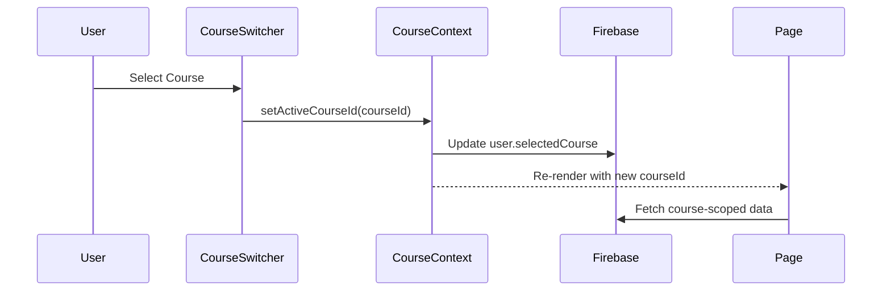
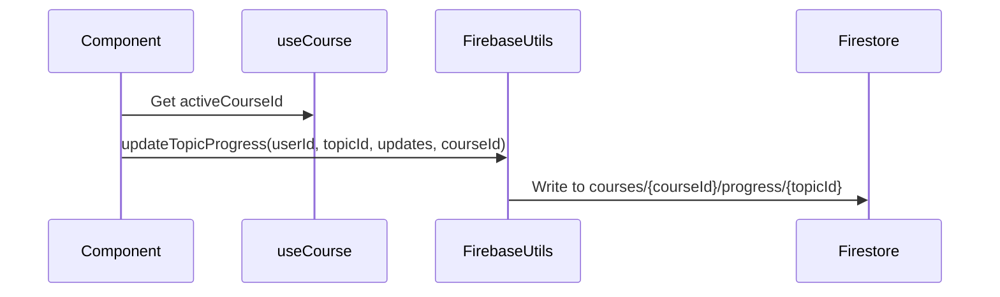

# Multi-Course Architecture Documentation

> Complete technical documentation for the multi-course data isolation architecture

---

## Table of Contents

1. [Overview](#overview)
2. [Features & Sub-Features Inventory](#features--sub-features-inventory)
3. [Database Schema](#database-schema)
4. [Service Layer Architecture](#service-layer-architecture)
5. [UI Components](#ui-components)
6. [Data Flow Diagrams](#data-flow-diagrams)
7. [Best Practices](#best-practices)

---

## Overview

The Exam Strategy Engine supports **multi-course preparation** - a single user can prepare for multiple exams (e.g., UPSC CSE, SSC CGL) with **complete data isolation** between courses.

### Key Principles

1. **Course-Scoped Data**: All learning data is stored under course-specific paths
2. **Single Active Course**: User works with one course at a time, switchable via UI
3. **Global User Data**: Some data (achievements, daily wellness) remains user-wide
4. **Backward Compatible**: Legacy users without courseId gracefully default to exam-based course

---

## Features & Sub-Features Inventory

### 1. Authentication & User Management ✅

| Feature | Sub-Feature | Course-Scoped |
|---------|-------------|---------------|
| Login | Email/Password, Google OAuth | No (global) |
| User Profile | Basic info, settings | No (global) |
| Course Selection | Active course toggle | Yes |

### 2. Syllabus Management ✅

| Feature | Sub-Feature | Course-Scoped |
|---------|-------------|---------------|
| Syllabus View | Subject/Topic/Subtopic hierarchy | ✅ Yes |
| Topic Progress | Status, time spent, mastery | ✅ Yes |
| Subtopic Progress | Completion state | ✅ Yes |
| Practice Questions | Solved question tracking | ✅ Yes |

**Database Path**: `users/{userId}/courses/{courseId}/syllabus`

### 3. Progress Tracking ✅

| Feature | Sub-Feature | Course-Scoped |
|---------|-------------|---------------|
| Topic Progress | Per-topic mastery levels | ✅ Yes |
| Overall Progress | Aggregated completion % | ✅ Yes |
| Time Tracking | Study time per topic | ✅ Yes |

**Database Path**: `users/{userId}/courses/{courseId}/progress/{topicId}`

### 4. Daily Logging ⚡

| Feature | Sub-Feature | Course-Scoped |
|---------|-------------|---------------|
| Daily Study Log | Hours, topics covered | No (global) |
| Wellness Log | Mood, energy, productivity | No (global) |
| Streak Tracking | Consecutive study days | No (global) |

> **By Design**: Daily wellness is user-wide, not course-specific

**Database Path**: `users/{userId}/dailyLogs/{date}`

### 5. Mock Test Logging ✅

| Feature | Sub-Feature | Course-Scoped |
|---------|-------------|---------------|
| Test Recording | Date, scores, papers | ✅ Yes |
| Performance Analytics | Score trends | ✅ Yes |

**Database Path**: `users/{userId}/courses/{courseId}/mockTests/{testId}`

### 6. Adaptive Testing ✅

| Feature | Sub-Feature | Course-Scoped |
|---------|-------------|---------------|
| Test Creation | AI-generated adaptive tests | ✅ Yes |
| Question Bank | User & system questions | Partial |
| Test History | Completed tests listing | ✅ Yes |
| Recommendations | AI test suggestions | ✅ Yes |

**Database Path**: `users/{userId}/adaptive_tests/{testId}`

### 7. Revision Queue ✅

| Feature | Sub-Feature | Course-Scoped |
|---------|-------------|---------------|
| Spaced Repetition | Auto-scheduled revisions | ✅ Yes |
| Review Progress | Revision completion | ✅ Yes |

### 8. Analytics Dashboard ✅

| Feature | Sub-Feature | Course-Scoped |
|---------|-------------|---------------|
| Performance Analytics | Mock test trends | ✅ Yes |
| Weak Areas | Topic-level analysis | ✅ Yes |
| Recommendations | Improvement suggestions | ✅ Yes |
| Skill Mastery | Subject proficiency | ✅ Yes |

### 9. Notes & Workspace ⚡

| Feature | Sub-Feature | Course-Scoped |
|---------|-------------|---------------|
| Handwritten Notes | Image uploads | ✅ Yes |
| Workspace Notes | General notes | No (global) |

> **By Design**: General workspace notes are user-wide

### 10. Achievements & Gamification ⚡

| Feature | Sub-Feature | Course-Scoped |
|---------|-------------|---------------|
| Achievement Badges | Earned achievements | No (global) |
| Streaks | Study continuity | No (global) |

> **By Design**: Achievements are user-wide recognition

---

## Database Schema

### Course-Scoped Collections

```
users/{userId}/
├── courses/{courseId}/
│   ├── syllabus              # Array of SyllabusSubject
│   ├── progress/{topicId}    # TopicProgress documents
│   ├── mockTests/{testId}    # MockTestLog documents
│   ├── study_sessions/{id}   # Study session logs
│   └── missions/{missionId}  # Learning missions
├── adaptive_tests/{testId}   # AdaptiveTest documents (has courseId field)
└── analytics_events/{id}     # Analytics events (has courseId field)
```

### Global Collections

```
users/{userId}/
├── profile                   # User profile data
├── settings                  # App preferences
├── dailyLogs/{date}          # Daily wellness logs
├── achievements/{id}         # User achievements
└── workspace/{noteId}        # General workspace notes
```

---

## Service Layer Architecture

### Firebase Utils (`lib/firebase/firebase-utils.ts`)

| Function | courseId | Notes |
|----------|----------|-------|
| `getSyllabus` | ✅ Optional | Falls back to user's current exam |
| `saveSyllabus` | ✅ Optional | Falls back to user's current exam |
| `saveSyllabusForCourse` | ✅ Required | Direct course-scoped save |
| `getSyllabusForCourse` | ✅ Required | Direct course-scoped read |
| `updateTopicProgress` | ✅ Optional | Course-scoped progress write |
| `getTopicProgress` | ✅ Optional | Course-scoped progress read |
| `getAllProgress` | ✅ Optional | Course-scoped progress aggregate |
| `toggleQuestionSolved` | ✅ Optional | Course-scoped solved questions |
| `getRevisionQueue` | ✅ Optional | Course-scoped spaced repetition |
| `saveMockTest` | ✅ Optional | Course-scoped mock test save |
| `getMockTests` | ✅ Optional | Course-scoped mock test list |
| `generateStudyInsights` | ✅ Optional | Course-scoped AI insights |

### Adaptive Testing Service (`lib/services/adaptive-testing-service.ts`)

| Function | courseId | Notes |
|----------|----------|-------|
| `getUserTests` | ✅ Optional | Filter tests by course |
| `generateTestRecommendations` | ✅ Optional | Course-scoped recommendations |
| `createAdaptiveTest` | ✅ In Request | Via TestConfig.courseId |

### Analytics Service (`lib/analytics/intelligent-analytics-service.ts`)

| Function | courseId | Notes |
|----------|----------|-------|
| `getPerformanceAnalytics` | ✅ In Options | Course-scoped analytics |
| `identifyWeakAreas` | ✅ Optional | Course-scoped weak areas |
| `getImprovementRecommendations` | ✅ Optional | Course-scoped recommendations |

### Background Sync Service (`lib/services/background-sync-service.ts`)

| Function | courseId | Notes |
|----------|----------|-------|
| `syncProgressData` | ✅ In Sync Data | Course-scoped path resolution |
| `syncMissionData` | ✅ In Sync Data | Course-scoped path resolution |

### Storage Utils (`lib/firebase/storage-utils.ts`)

| Function | courseId | Notes |
|----------|----------|-------|
| `uploadTopicNote` | ✅ Optional | Stores in `users/{uid}/courses/{courseId}/notes` |
| `getTopicNotes` | ✅ Optional | Lists from course-scoped path |
| `deleteTopicNote` | N/A | Deletes by storage path (implicit scope) |

---

## UI Components

### Pages Using `useCourse` Hook

| Page Route | Component | courseId Usage |
|------------|-----------|----------------|
| `/syllabus` | SyllabusPage | ✅ All data calls |
| `/syllabus/[topicId]` | TopicDetailPage | ✅ All data calls |
| `/syllabus/[topicId]/[subtopicIndex]` | SubtopicPage | ✅ All data calls |
| `/subjects` | SubjectsPage | ✅ getSyllabus |
| `/subjects/[subjectId]` | SubjectDetailPage | ✅ getSyllabus |
| `/review` | ReviewPage | ✅ getRevisionQueue |
| `/strategy` | StrategyPage | ✅ All progress calls |
| `/profile` | ProfilePage | ✅ saveSyllabusForCourse |
| `/test` | TestPage | ✅ getUserTests, recommendations |
| `/log/daily` | DailyLogPage | ✅ Topic selection |
| `/log/mock` | MockLogPage | ✅ saveMockTest |
| `/notes-revision` | NotesPage | ✅ Storage paths |
| `/topic/[topicId]` | TopicPage | ✅ Progress tracking |

### Global Components Using `useCourse`

| Component | courseId Usage |
|-----------|----------------|
| `AdaptiveDashboard` | ✅ All dashboard data |
| `AnalyticsDashboard` | ✅ Analytics service calls |
| `AnalyticsWidget` | ✅ Performance analytics |
| `CourseSwitcher` | ✅ Course selection UI |
| `TestConfigModal` | ✅ Test creation |
| `LearningAnalyticsDashboard` | ✅ Analytics queries |

---

## Data Flow Diagrams

### Course Selection Flow



### Data Write Flow



---

## Best Practices

### When Adding New Features

1. **Always accept `courseId?: string`** in data functions
2. **Use `useCourse()` hook** in components needing course data
3. **Pass `activeCourseId`** to all service calls
4. **Use conditional spread** for TypeScript exact optional props:
   ```typescript
   // ✅ Correct
   service.getData(userId, activeCourseId ? { courseId: activeCourseId } : undefined)
   
   // ❌ Incorrect (TS error with exactOptionalPropertyTypes)
   service.getData(userId, { courseId: activeCourseId ?? undefined })
   ```

### Data Path Patterns

```typescript
// Course-scoped data
`users/${userId}/courses/${courseId}/syllabus`
`users/${userId}/courses/${courseId}/progress/${topicId}`
`users/${userId}/courses/${courseId}/mockTests/${testId}`

// Global user data (no courseId)
`users/${userId}/dailyLogs/${date}`
`users/${userId}/achievements/${achievementId}`
`users/${userId}/profile`
```

### Cache Invalidation

When writing course-scoped data, invalidate relevant caches:
```typescript
invalidateSyllabusCache(courseId);
invalidateProgressCache(userId);
```

---

## Summary

| Metric | Count |
|--------|-------|
| App Routes with useCourse | 13 |
| Firebase Functions with courseId | 20+ |
| Analytics Functions with courseId | 5 |
| Global Components with useCourse | 6 |
| By-Design Global Features | 3 |

**Status**: ✅ Multi-course architecture 100% complete
